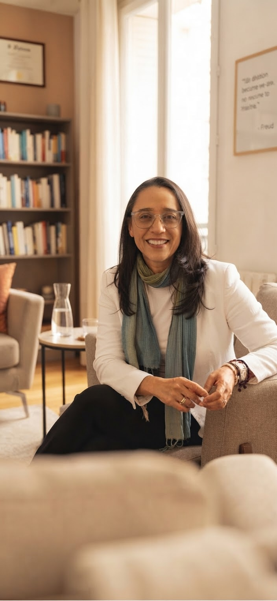

<!DOCTYPE html>
<html lang="pt-BR">
<head>
  <meta charset="UTF-8">
  <meta name="viewport" content="width=device-width, initial-scale=1.0">

  <title>Carolina de Azevedo | Psicanalista Online</title>
  <meta name="description" content="Carolina de Azevedo, psicanalista. Atendimento exclusivamente online para adultos.">

  <link rel="preconnect" href="https://fonts.googleapis.com">
  <link rel="preconnect" href="https://fonts.gstatic.com" crossorigin>
  <link href="https://fonts.googleapis.com/css2?family=DM+Serif+Display&family=Nunito:wght@400;500;600;700&display=swap" rel="stylesheet">

  
</head>

<body>

  <nav>
    

      <a class="brand" href="#inicio">
        Carolina de Azevedo· Psicanalista
      </a>

      <ul>
        <li><a href="#sobre">Sobre mim</a></li>
        <li><a href="#analise">A análise</a></li>
        <li><a href="#como-comecar">Como começar</a></li>
        <li><a href="#contato">Contato</a></li>
      </ul>

    

  </nav>

  <main>

    <section class="hero" id="inicio">

      

        

          

            Psicanálise — atendimento online
          

          <h1>
            Você não precisa estar no limite para procurar análise.
          </h1>

          

            Às vezes, alguma coisa começa a pesar, se repetir ou simplesmente
            deixar de fazer sentido — mesmo quando, por fora, parece estar tudo bem.
          

          

            <a class="button button-primary"
               href="https://wa.me/5511964068930"
               target="_blank"
               rel="noopener">
              Vamos conversar
            </a>

            <a class="button button-secondary" href="#sobre">
              Um pouco sobre mim
            </a>

          

          

            Você não precisa chegar sabendo exatamente o que dizer.
          

        

        

          

        

      

    </section>

    <section class="section-soft" id="por-que">

      

        

          Tem alguma coisa pedindo mais atenção?
        

        

          Você não precisa estar “muito mal” para começar uma análise.
          Às vezes, o que leva alguém a procurar escuta é justamente a sensação
          de que alguma coisa não está encontrando um lugar.
        

        

          
Ansiedade

          
Angústia

          
Sensação de vazio

          
Repetir os mesmos padrões

          
Dificuldades nos relacionamentos

          
Luto e perdas

          
Insônia

          
Crises de choro

          
Mudanças importantes

          
Dificuldade de se compreender

        

        

          Se você se reconhece em alguma coisa acima, isso pode ser motivo suficiente
          para começar uma análise.
        

      

    </section>

    <section id="sobre">

      

        

          

            Sobre mim
          

          <h2>
            Uma escuta que leva o vínculo a sério.
          </h2>

          

            Sou Carolina de Azevedo, psicanalista, e trabalho exclusivamente
            com atendimento online. Durante parte da minha trajetória profissional,
            também trabalhei presencialmente, e essa experiência me ensinou que
            a qualidade de um encontro depende muito mais da presença construída
            entre duas pessoas do que das paredes que as cercam.
          

          

            Meu trabalho é inspirado especialmente pelas contribuições de
            Sándor Ferenczi, pela importância que dá ao vínculo, à sensibilidade
            e à experiência subjetiva de cada pessoa.
          

          

            Recebo adultos que desejam compreender melhor seus sintomas,
            repetições, conflitos, relações e aquilo que, muitas vezes,
            ainda não conseguem nomear.
          

          

            <strong>
              Formação em Psicanálise pelo CEP — Centro de Estudos Psicanalíticos.
            </strong>
          

          

            <h3>
              Antes da psicanálise
            </h3>

            

              Minha formação e minha experiência profissional também passaram
              por outros caminhos. Durante muitos anos, trabalhei com comércio
              exterior e negociações internacionais, no Brasil e no exterior,
              experiência que me levou a viver diferentes contextos profissionais
              e culturais.
            

            

              Mais tarde, esse percurso ganhou outro sentido quando a psicanálise
              passou a ocupar um lugar central na minha vida. A formação pelo
              Centro de Estudos Psicanalíticos marcou uma mudança de direção,
              mas não como ruptura com tudo o que veio antes, e sim como uma nova
              forma de olhar para aquilo que sempre me interessou: as pessoas,
              suas histórias, seus vínculos e os caminhos que encontram para lidar
              com o que vivem.
            

          

          

            Hoje, dedico-me ao atendimento psicanalítico de adultos,
            exclusivamente online.
          

        

        

          

        

      

    </section>

    <section class="section-soft" id="analise">

      

        

          A análise
        

        <h2>
          Uma análise não precisa ser um lugar de respostas.
        </h2>

        

          Pode ser um lugar onde aquilo que ainda parece confuso começa,
          aos poucos, a ganhar espaço, palavras e sentido.

        

        

          A psicanálise não oferece fórmulas prontas. O trabalho se constrói
          a partir do que você traz, das perguntas que aparecem no caminho
          e também daquilo que, às vezes, ainda não pode ser dito.
        

      

    </section>

    <section id="como-comecar">

      

        

          Como começar
        

        <h2>
          Começar uma análise pode ser mais simples do que parece.
        </h2>

        

          

            

              01
            

            <h3>
              Primeira conversa
            </h3>

            

              Nosso primeiro encontro é um espaço para falar sobre você
              e sobre o que está vivendo. A partir dessa conversa,
              entenderemos juntos se faz sentido iniciar um trabalho.
            

          

          

            

              02
            

            <h3>
              Atendimento online
            </h3>

            

              As sessões acontecem por videochamada, em um espaço reservado
              e com privacidade.
            

          

          

            

              03
            

            <h3>
              Frequência
            </h3>

            

              A frequência dos encontros é definida de acordo com cada caso
              e com o trabalho que vamos construindo juntos.
            

          

        

        

          Cada sessão tem duração aproximada de 50 minutos.
        

      

    </section>

    <section class="section-soft" id="artigos">

      

        

          Artigos
        

        <h2>
          Algumas coisas que penso sobre a clínica.
        </h2>

        

          <article class="card">

            <h3>
              O valor da delicadeza na escuta clínica
            </h3>

            

              Em breve
            

          </article>

          <article class="card">

            <h3>
              Trauma e reparação a partir de Ferenczi
            </h3>

            

              Em breve
            

          </article>

          <article class="card">

            <h3>
              O que muda — e o que não muda — na análise online
            </h3>

            

              Em breve
            

          </article>

        

      

    </section>

    <section id="contato">

      

        <h2>
          Contato
        </h2>

        

          Se algo do que você leu aqui fez sentido para você, escreva.
          A primeira conversa pode ser simplesmente isso: um começo.
        

        

          <a href="https://wa.me/5511964068930"
             target="_blank"
             rel="noopener">
            WhatsApp · (11) 96406-8930
          </a>

          <a href="mailto:psicanalista.carolina@gmail.com">
            psicanalista.carolina@gmail.com
          </a>

        

      

    </section>

  </main>

  <footer>

    

      Carolina de Azevedo — Psicanalista 
      Atendimento exclusivamente online.

    

  </footer>

</body>
</html>
